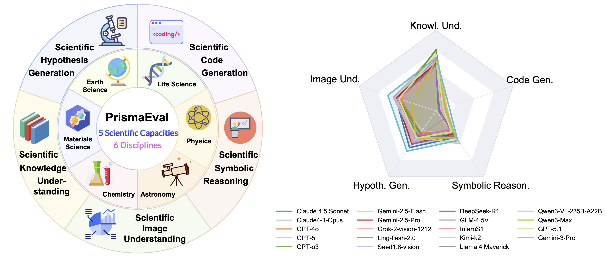
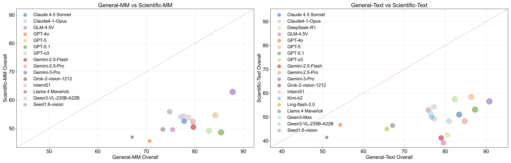

# PrismaEval ToolKit

**PrismaEval** is an open-source evaluation framework and leaderboard for measuring the *scientific intelligence* of large language and vision–language models.  
It targets the full research workflow which is from scientific image understanding to hypothesis generation and provides a reproducible toolkit that unifies data loading, prompt construction, inference and evaluation.

<div align="center">
  
</div>

Modern frontier language models routinely score near *90* on general‑purpose benchmarks, yet even the strongest model (e.g., **Gemini 3 Pro**) drops below *60* when challenged by rigorous, domain‑specific scientific tasks.  PrismaEval makes this **general‑versus‑scientific gap** explicit and supplies the evaluation infrastructure needed to guide the integration of broad instruction‑tuned abilities with specialised skills in coding, symbolic reasoning and diagram understanding.

<div align="center">
  
</div>

## Key Features
| Category | Highlights |
|----------|------------|
| **Five Core Dimensions** | Scientific Knowledge Understanding, Scientific Code Generation, Scientific Symbolic Reasoning, Scientific Hypothesis Generation, Scientific Image Understanding. |
| **Discipline Coverage** | Life Science • Astronomy • Earth Science • Chemistry • Materials Science • Physics. |
| **Multimodal & Executable Scoring** | Supports text, code, and image inputs; integrates code tasks and LLM-judge fallback for open-ended answers. |
| **Reproducible & Extensible** | Clear dataset and model registries, minimised hard-coding and modular evaluators make new tasks or checkpoints easy to plug in. |

<hr style="height:1px;background:black;border:none;" />

## News
* **2025‑12‑05 · PrismaEval v1 Launch**  
  &nbsp;&nbsp;• Initial public release of a science‑focused evaluation toolkit and leaderboard devoted to realistic research workflows.

  &nbsp;&nbsp;• Initial evaluation of 20 frontier models (closed & open source) now live at <https://discovery.intern-ai.org.cn/sciprismax/leaderboard>.

  &nbsp;&nbsp;• Coverage: five scientific capability dimensions × six major disciplines in the initial benchmark suite.

* **Community Submissions Open**  
  Submit your benchmarks via pull request to appear on the official leaderboard.

## Codebase Updates
* **Execution‑based Scoring**  
  Code‑generation tasks (SciCode, AstroVisBench) are now graded via sandboxed unit tests.

## Quick Start

Get from clone to first scores in minutes&mdash;see our local
[QuickStart](docs/en/Quickstart.md) / [快速开始](docs/zh-CN/Quickstart.md)
guides, or consult the VLMEvalKit tutorial  
<https://vlmevalkit.readthedocs.io/en/latest/Quickstart.html> for additional reference.

### 1 · Install
```bash
git clone https://github.com/PrismaEval/PrismaEval-Kit.git
cd PrismaEval-Kit
pip install -e .[all]    # brings in vllm, openai‑sdk, hf_hub, etc.
```

### 2 · (Optional) add API keys  
Create a `.env` at the repo root **only if** you will call API models or
use an LLM‑as‑judge backend:
```bash
OPENAI_API_KEY=...
GOOGLE_API_KEY=...
DASHSCOPE_API_KEY=...
```
If no keys are provided, PrismaEval falls back to rule‑based scoring
whenever possible.

### 3 · Run a API demo test
```bash
python run.py \
  --dataset SFE \
  --model gpt-4o \
  --mode all \
  --work-dir outputs/demo_api \
  --verbose
```

### 4 · Evaluate a local/GPU model
```bash
python run.py \
  --dataset MaScQA \
  --model qwen_chat \
  --mode infer \
  --work-dir outputs/demo_qwen \
  --verbose

# ➜ Re‑run with --mode all after adding an API key
#     if the benchmark requires an LLM judge.
```

## Acknowledgements

PrismaEval ToolKit is built on top of the excellent **[VLMEvalKit](https://github.com/open-compass/VLMEvalKit)** framework and we thank the OpenCompass team not only for open‑sourcing their engine, but also for publishing thorough deployment and development guides ([Quick Start](https://vlmevalkit.readthedocs.io/en/latest/Quickstart.html), [Development Notes](https://vlmevalkit.readthedocs.io/en/latest/Development.html)) that streamlined our integration.

We also acknowledge the core PrismaEval contributors for their efforts on dataset curation, evaluation design, and engine implementation: Jun Yao, Han Deng, Yizhou Wang, Jiabei Xiao, Jiaqi Liu, Encheng Su, Yujie Liu, Weida Wang, Junchi Yao, Haoran Sun, Runmin Ma, Bo Zhang, Dongzhan Zhou, Shufei Zhang, Peng Ye, Xiaosong Wang, and Shixiang Tang, as well as all community testers who provided early feedback.
